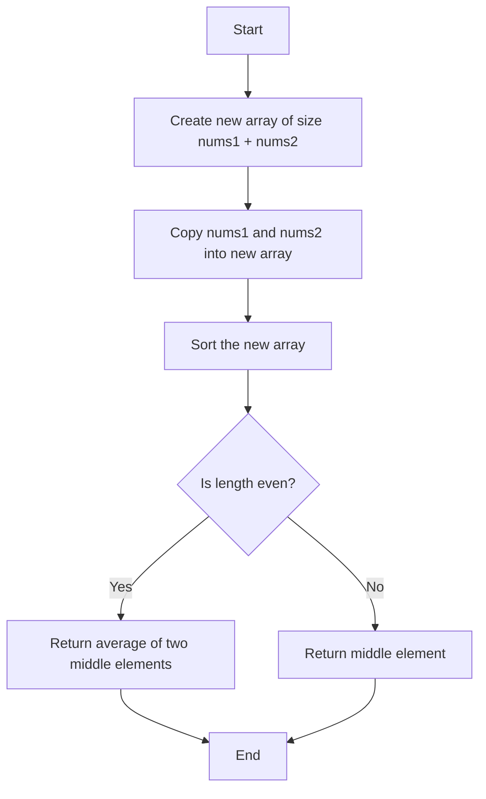
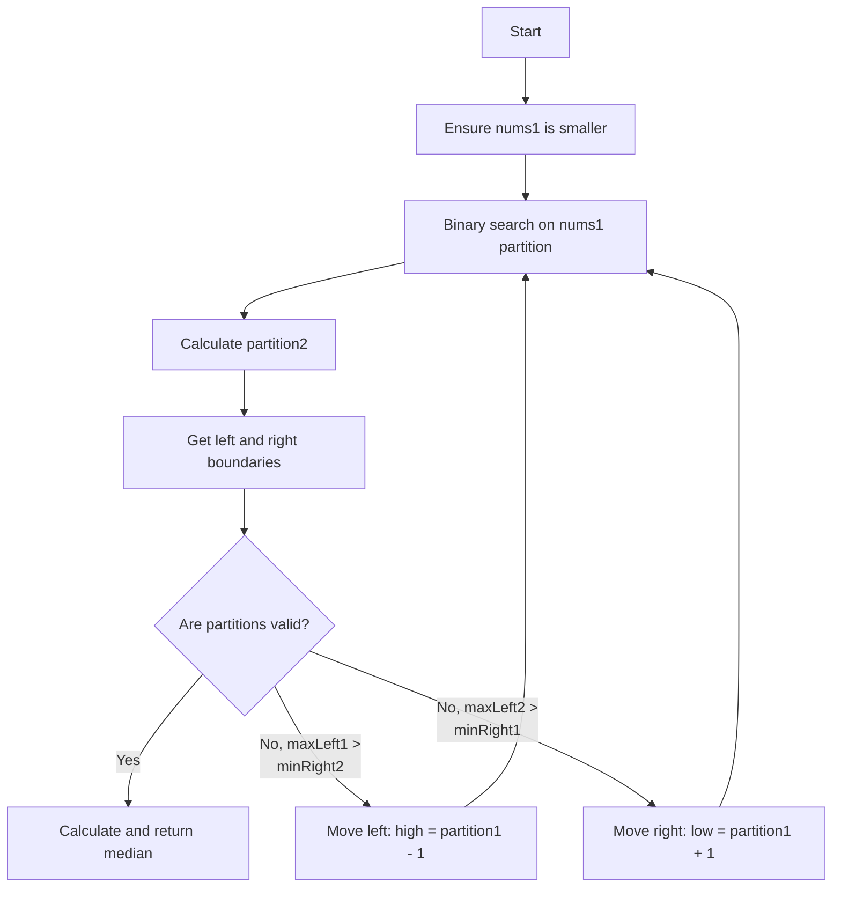

<!-- LC_PROBLEM_META_START -->
{"slug":"median-of-two-sorted-arrays","title":"Median of Two Sorted Arrays","difficulty":"Hard","url":"https://leetcode.com/problems/median-of-two-sorted-arrays/submissions/2165543145/","firstAdded":"2026-10-07","lastUpdated":"2026-10-07","problemExplanation":"Given two sorted arrays of different sizes, we need to find the median value of all elements combined as if the arrays were merged. The median is the middle number in a sorted list, or the average of the two middle numbers if the total count is even. We must do this efficiently without fully merging the arrays.","examples":[{"input":"nums1 = [1, 3], nums2 = [2]","output":"2.0","explanation":"Combined sorted array is [1, 2, 3]. The middle element is 2."}],"approaches":[{"language":"unknown","name":"Accepted Solution","firstAdded":"2026-10-07","lastUpdated":"2026-10-07","explanation":"No explanation recorded.","trace":"","flow":"","keyIdea":"Not provided.","timeComplexity":"Not provided","spaceComplexity":"Not provided","interviewNote":"","history":[]},{"language":"java","name":"Merge and Sort Approach","firstAdded":"2026-10-07","lastUpdated":"2026-10-07","explanation":"We create a new array large enough to hold all elements from both input arrays. We copy all elements of the first array and the second array into this new combined array. Then, we use Arrays.sort() to sort the entire combined array. Finally, we check if the total length is even or odd to calculate and return the median.","trace":"Input: nums1 = [1, 3], nums2 = [2]. Step 1: Create new array arr of size 3. Step 2: Copy nums1 into arr -> [1, 3, 0]. Step 3: Copy nums2 into arr starting at index 2 -> [1, 3, 2]. Step 4: Sort arr -> [1, 2, 3]. Step 5: Length n = 3, which is odd. Step 6: Return arr[n/2] = arr[1] = 2.0.","flow":"flowchart TD\nA[Start] --> B[Create new array of size nums1 + nums2]\nB --> C[Copy nums1 and nums2 into new array]\nC --> D[Sort the new array]\nD --> E{Is length even?}\nE -->|Yes| F[Return average of two middle elements]\nE -->|No| G[Return middle element]\nF --> H[End]\nG --> H[End]","keyIdea":"Combine both arrays into one, sort it, and find the middle element.","timeComplexity":"O((m + n) log(m + n))","spaceComplexity":"O(m + n)","interviewNote":"While this approach is easy to write, an optimal solution would achieve O(m + n) or O(log(min(m, n))) time using binary search without sorting the entire array.","history":["07 October 2026 — Recovered from existing solution file."]},{"language":"java","name":"Binary Search on Partition","firstAdded":"2026-10-07","lastUpdated":"2026-10-07","explanation":"We ensure we always perform binary search on the smaller array to keep the time complexity optimal. We partition both arrays such that the left side contains the smaller half of all combined elements and the right side contains the larger half. We adjust our partition points until the largest element on the left is less than or equal to the smallest element on the right for both arrays. Once this correct partition is found, we calculate the median using the boundary elements.","trace":"Initialize nums1 = [1, 3], nums2 = [2]. m = 2, n = 1. nums1 is smaller so we binary search on it. low = 0, high = 2. Iteration 1: partition1 = 1, partition2 = (2 + 1 + 1) / 2 - 1 = 1. maxLeft1 = 1, minRight1 = 3, maxLeft2 = 2, minRight2 = infinity. Check condition: maxLeft1 (1) <= minRight2 (infinity) and maxLeft2 (2) <= minRight1 (3). This is true. Total elements count is odd (3), so return max(maxLeft1, maxLeft2) = max(1, 2) = 2.0.","flow":"flowchart TD\nA[Start] --> B[Ensure nums1 is smaller]\nB --> C[Binary search on nums1 partition]\nC --> D[Calculate partition2]\nD --> E[Get left and right boundaries]\nE --> F{Are partitions valid?}\nF --\nYes --> G[Calculate and return median]\nF -- No, maxLeft1 >\nminRight2 --> H[Move left: high = partition1 - 1]\nF -- No, maxLeft2 >\nminRight1 --> I[Move right: low = partition1 + 1]\nH --> C\nI --> C","keyIdea":"Cut both sorted arrays into left and right halves using binary search so that all elements on the left are smaller than or equal to all elements on the right.","timeComplexity":"O(log(min(m, n)))","spaceComplexity":"O(1)","interviewNote":"Always check array lengths first to ensure you binary search the smaller array; this guarantees the logarithmic time complexity.","history":["07 October 2026 — New accepted approach added."]}],"reviewHistory":[]}
<!-- LC_PROBLEM_META_END -->

# Median of Two Sorted Arrays

- **Difficulty:** Hard
- **LeetCode:** https://leetcode.com/problems/median-of-two-sorted-arrays/submissions/2165543145/
- **First Added:** 07 October 2026
- **Last Updated:** 07 October 2026

## What Is the Problem?

Given two sorted arrays of different sizes, we need to find the median value of all elements combined as if the arrays were merged. The median is the middle number in a sorted list, or the average of the two middle numbers if the total count is even. We must do this efficiently without fully merging the arrays.

## Sample Input / Output

### Example 1

**Input:**

```text
nums1 = [1, 3], nums2 = [2]
```

**Output:**

```text
2.0
```

**Explanation:** Combined sorted array is [1, 2, 3]. The middle element is 2.


---


## Approach 1 — Accepted Solution

**Language:** unknown  
**First Added:** 07 October 2026  
**Last Updated:** 07 October 2026

### How This Approach Works

No explanation recorded.

### Step-by-Step Trace

No trace recorded.

### Simple Flow

_Flow diagram unavailable._

### Key Idea

Not provided.

### Complexity

- **Time:** Not provided
- **Space:** Not provided

### Interview Note

Review the key idea and complexity before an interview.

### History

- 07 October 2026 — Initial accepted approach added.


## Approach 2 — Merge and Sort Approach

**Language:** Java  
**First Added:** 07 October 2026  
**Last Updated:** 07 October 2026

### How This Approach Works

We create a new array large enough to hold all elements from both input arrays. We copy all elements of the first array and the second array into this new combined array. Then, we use Arrays.sort() to sort the entire combined array. Finally, we check if the total length is even or odd to calculate and return the median.

### Step-by-Step Trace

Input: nums1 = [1, 3], nums2 = [2]. Step 1: Create new array arr of size 3. Step 2: Copy nums1 into arr -> [1, 3, 0]. Step 3: Copy nums2 into arr starting at index 2 -> [1, 3, 2]. Step 4: Sort arr -> [1, 2, 3]. Step 5: Length n = 3, which is odd. Step 6: Return arr[n/2] = arr[1] = 2.0.

### Simple Flow



### Key Idea

Combine both arrays into one, sort it, and find the middle element.

### Complexity

- **Time:** O((m + n) log(m + n))
- **Space:** O(m + n)

### Interview Note

While this approach is easy to write, an optimal solution would achieve O(m + n) or O(log(min(m, n))) time using binary search without sorting the entire array.

### History

- 07 October 2026 — Recovered from existing solution file.


## Approach 3 — Binary Search on Partition

**Language:** Java  
**First Added:** 07 October 2026  
**Last Updated:** 07 October 2026

### How This Approach Works

We ensure we always perform binary search on the smaller array to keep the time complexity optimal. We partition both arrays such that the left side contains the smaller half of all combined elements and the right side contains the larger half. We adjust our partition points until the largest element on the left is less than or equal to the smallest element on the right for both arrays. Once this correct partition is found, we calculate the median using the boundary elements.

### Step-by-Step Trace

Initialize nums1 = [1, 3], nums2 = [2]. m = 2, n = 1. nums1 is smaller so we binary search on it. low = 0, high = 2. Iteration 1: partition1 = 1, partition2 = (2 + 1 + 1) / 2 - 1 = 1. maxLeft1 = 1, minRight1 = 3, maxLeft2 = 2, minRight2 = infinity. Check condition: maxLeft1 (1) <= minRight2 (infinity) and maxLeft2 (2) <= minRight1 (3). This is true. Total elements count is odd (3), so return max(maxLeft1, maxLeft2) = max(1, 2) = 2.0.

### Simple Flow



### Key Idea

Cut both sorted arrays into left and right halves using binary search so that all elements on the left are smaller than or equal to all elements on the right.

### Complexity

- **Time:** O(log(min(m, n)))
- **Space:** O(1)

### Interview Note

Always check array lengths first to ensure you binary search the smaller array; this guarantees the logarithmic time complexity.

### History

- 07 October 2026 — New accepted approach added.


## Code

Solution code is stored in the language-specific solution file in this folder.
