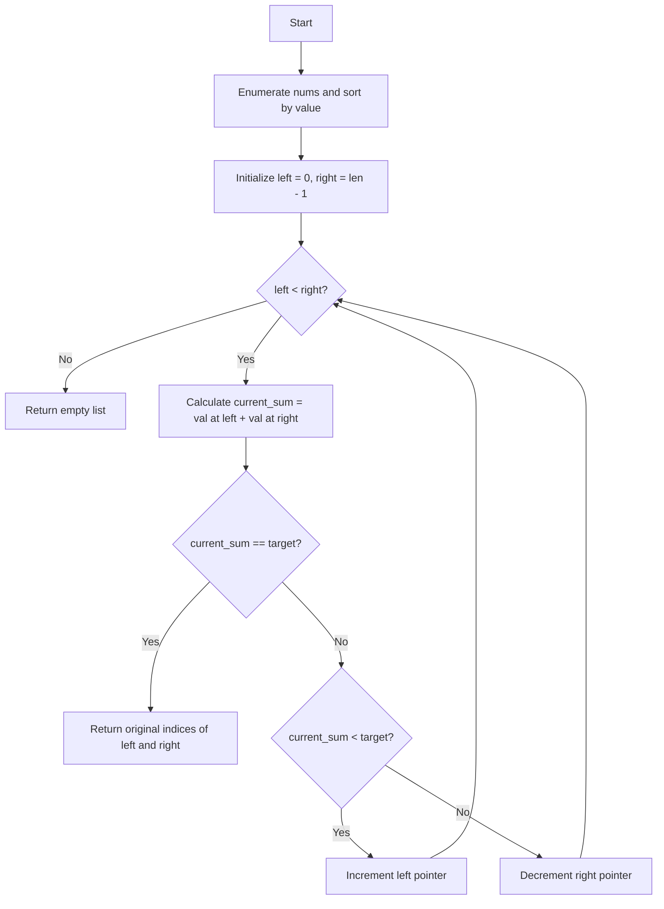

# Two Sum

- **Difficulty:** Easy
- **LeetCode:** [https://leetcode.com/problems/two-sum/submissions/2165061979/](https://leetcode.com/problems/two-sum/submissions/2165061979/)
- **First Added:** 07 October 2026
- **Last Updated:** 07 October 2026

## What Is the Problem?

Given an array of integers and a target sum, find the indices of the two numbers in the array that add up to the target.


### Example 1

**Input:**

```text
nums = [2, 7, 11, 15], target = 9
```

**Output:**

```text
[0, 1]
```

The numbers at indices 0 and 1 are 2 and 7. Their sum is 2 + 7 = 9, which matches the target.


---


## Approach 1 — Sorting and Two Pointers

**Language:** Python  
**First Added:** 07 October 2026  
**Last Updated:** 07 October 2026

### How This Approach Works

This solution first pairs each number with its original index so we don't lose track of their positions. Then, it sorts these pairs in ascending order based on the numbers. It uses two pointers: one at the start (left) and one at the end (right) of the sorted list. It calculates the sum of the numbers at both pointers. If the sum equals the target, it returns the original indices. If the sum is less than the target, it moves the left pointer forward to increase the sum. If the sum is greater than the target, it moves the right pointer backward to decrease the sum.

### Step-by-Step Trace

Example: nums = [3, 2, 4], target = 6
1. Enumerate and sort: indexed_nums = [(1, 2), (0, 3), (2, 4)]
2. Initialize pointers: left = 0, right = 2
3. Iteration 1: current_sum = indexed_nums[0][1] + indexed_nums[2][1] = 2 + 4 = 6. current_sum == target (6 == 6) is True. Return original indices [indexed_nums[0][0], indexed_nums[2][0]] which is [1, 2].

### Simple Flow



### Key Idea

Pair numbers with their original indices, sort by value, and use two pointers converging from both ends to find the target sum.

### Complexity

- **Time:** O(N log N)
- **Space:** O(N)

### Interview Note

While sorting takes O(N log N) time which is sub-optimal compared to the O(N) hash map approach, it is a great demonstration of applying the two-pointer technique after preprocessing.

### History

- 07 October 2026 — New accepted approach added.


## Code

Solution code is stored in the language-specific solution file in this folder.

## History

- 07 October 2026 — Accepted solution added.
